# TranSPormer: a transformer for the Travelling Salesman Problem
This repository presents a proof-of-concept of a transformer neural network to address the Travelling Salesman Problem avoiding any auto-regressive component.
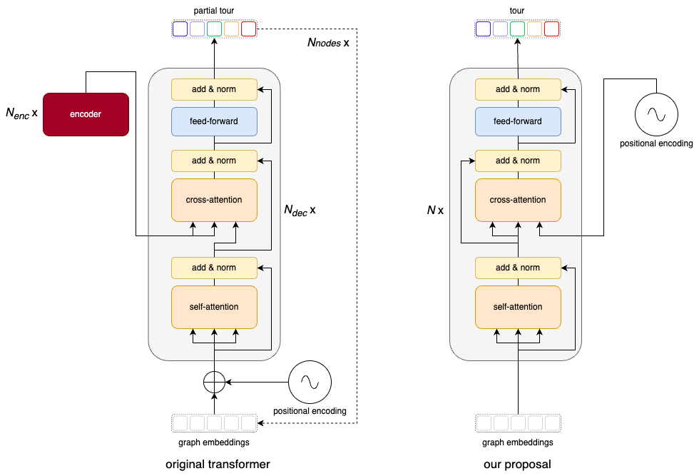

 
We rely on a cross-attention layer where the positional encodings represent the queries, while keys and values comes from the graph node embeddings.

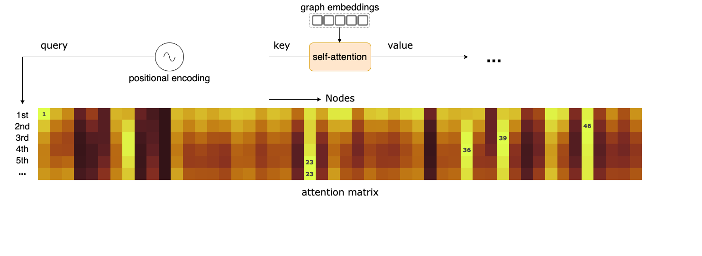

 
An instance of an attention matrix from our model before and after training.

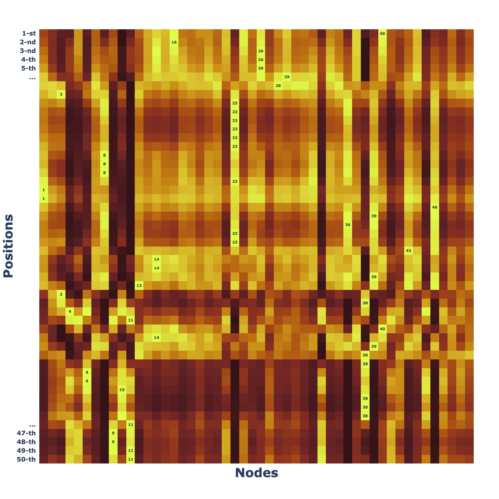
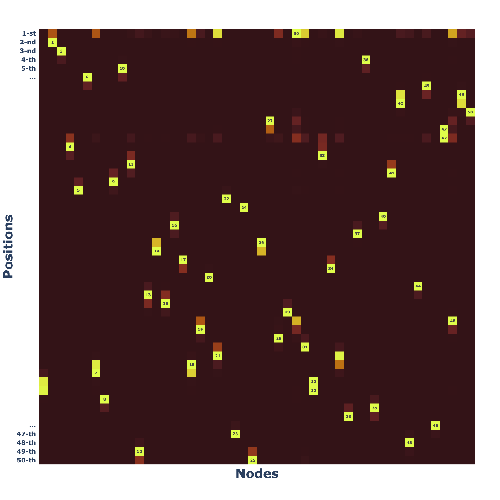

 

Some examples of tours generated by our model that are shorter than those produced by the Christofides algorithm from [NetworkX](https://networkx.org/documentation/stable/reference/algorithms/generated/networkx.algorithms.approximation.traveling_salesman.traveling_salesman_problem.html).
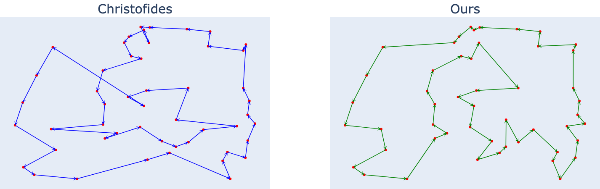
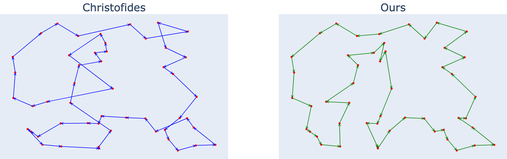
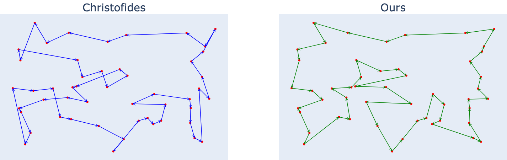
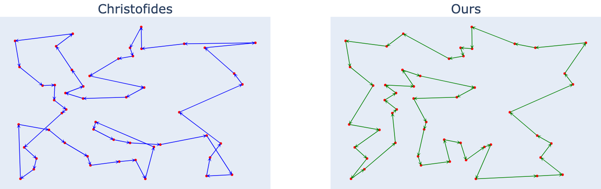
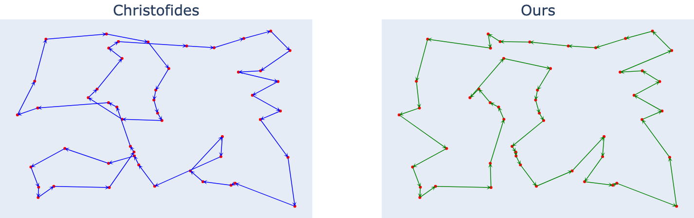
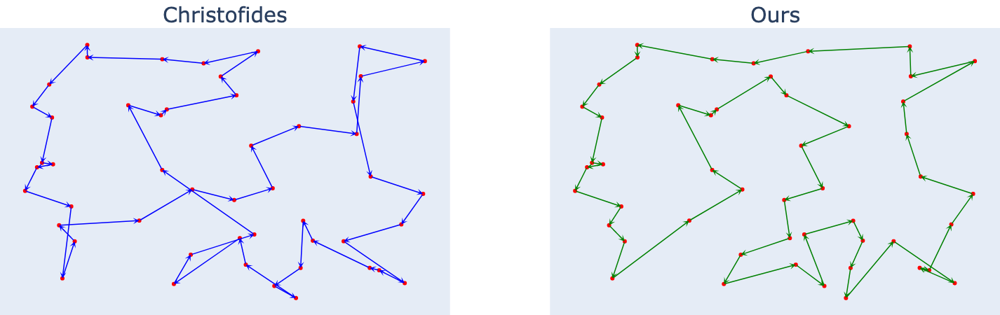
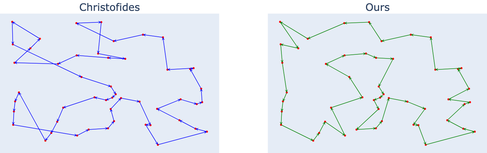
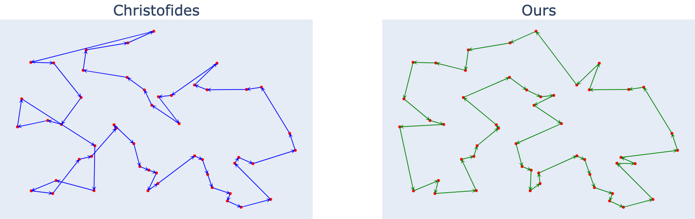
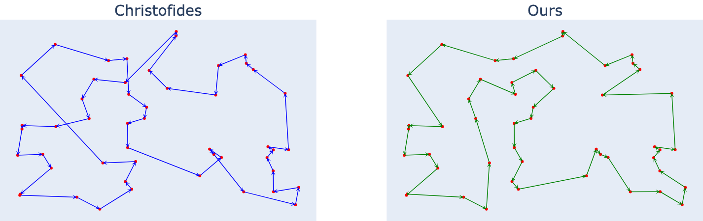
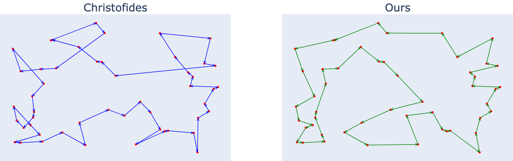

 

### Create a dataset of 10k random graphs of 50 nodes each
`> python create_dataset.py --path ./my_dataset --n 10000 --n_nodes 50`