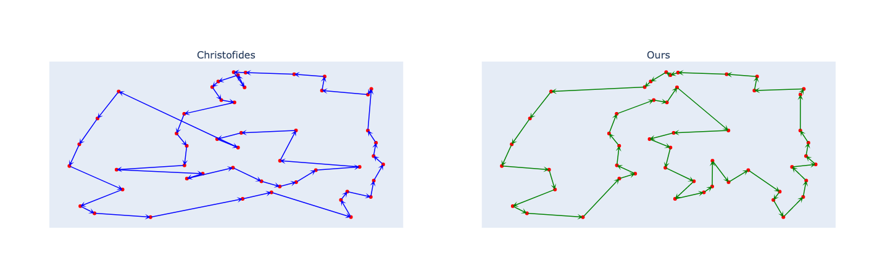
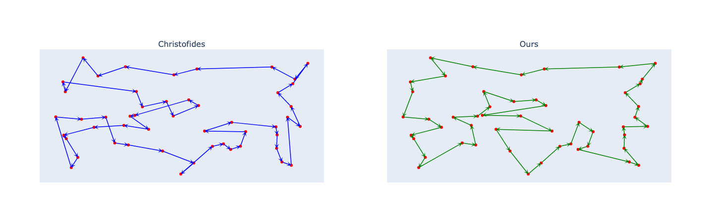

# TranSPormer: a transformer for the Travelling Salesman Problem
This repository presents a proof-of-concept of a transformer neural network to address the Travelling Salesman Problem avoiding any auto-regressive component.

 

Some examples of tours generated by our model in comparison with those produced by the Chrisofides algorithm.

